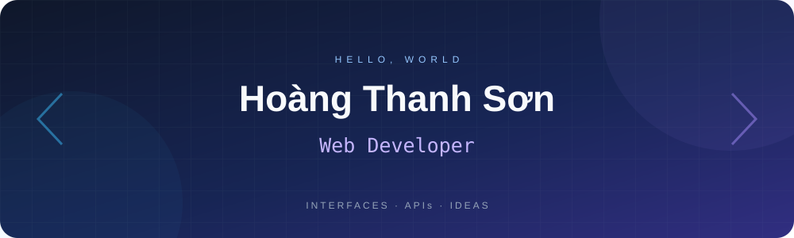

<div align="center">



</div>

```ts
const developer = {
  name: "Hoàng Thanh Sơn",
  role: "Web Developer",
  education: "Academy of Cryptography Techniques",
  location: "Vietnam",
  focus: ["Scalable web applications", "Clean architecture", "Developer-friendly APIs"],
}
```

<div align="center">



### Frontend

 &nbsp;
 &nbsp;
 &nbsp;
 &nbsp;
 &nbsp;


<sub>HTML · CSS · JavaScript · TypeScript · React · Next.js</sub>

<br />

### Backend & Database

 &nbsp;
 &nbsp;
 &nbsp;
 &nbsp;


<sub>Express · NestJS · PostgreSQL · Prisma · Redis</sub>

<br />

### Tools & Infrastructure

 &nbsp;
 &nbsp;
 &nbsp;


<sub>Docker · Git · Postman · Swagger</sub>

<br />


<br />

### A little progress, every day

<picture>
  <source media="(prefers-color-scheme: dark)" srcset="https://raw.githubusercontent.com/thanhsonls12/thanhsonls12/output/github-snake-dark.svg" />
  <source media="(prefers-color-scheme: light)" srcset="https://raw.githubusercontent.com/thanhsonls12/thanhsonls12/output/github-snake.svg" />
  
</picture>

<br />


</div>
